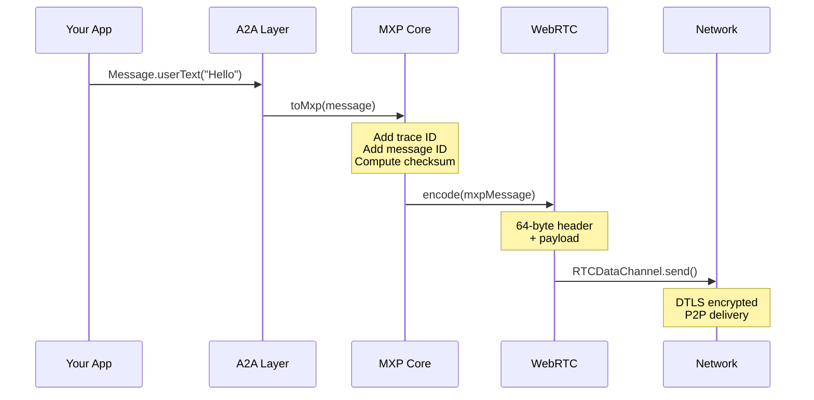
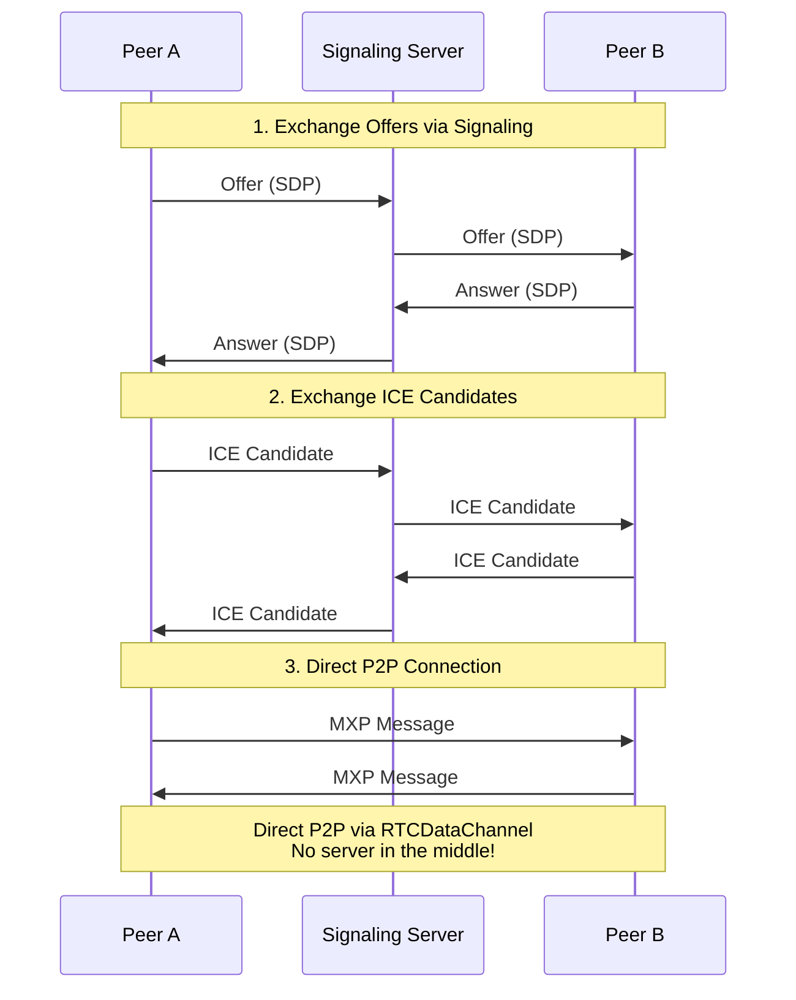

# MXP JavaScript/TypeScript SDK

**High-performance binary protocol for AI agent communication**

[](https://www.npmjs.com/package/@mxp/protocol)
[](LICENSE)

> The JavaScript/TypeScript implementation of [MXP Protocol](https://github.com/yafatek/mxp-protocol)

---

## 📐 Architecture Overview

```
┌─────────────────────────────────────────────────────────────────────────────┐
│                              YOUR APPLICATION                                │
│                    (AI Agent, Chatbot, Multi-Agent System)                   │
└─────────────────────────────────────────────────────────────────────────────┘
                                       │
                                       ▼
┌─────────────────────────────────────────────────────────────────────────────┐
│                           A2A COMPATIBILITY LAYER                            │
│  ┌─────────────┐  ┌─────────────┐  ┌─────────────┐  ┌─────────────────────┐ │
│  │   Message   │  │    Task     │  │  AgentCard  │  │     JSON-RPC        │ │
│  │   + Part    │  │  + Artifact │  │  + Skills   │  │  Request/Response   │ │
│  └─────────────┘  └─────────────┘  └─────────────┘  └─────────────────────┘ │
│                              @mxp/protocol/a2a                               │
└─────────────────────────────────────────────────────────────────────────────┘
                                       │
                            toMxp() ◄──┴──► fromMxp()
                                       │
┌─────────────────────────────────────────────────────────────────────────────┐
│                             MXP PROTOCOL CORE                                │
│  ┌─────────────────────────────────────────────────────────────────────┐    │
│  │                         64-byte Header                               │    │
│  │  ┌────────┬────────┬───────┬──────────┬──────────┬────────────────┐ │    │
│  │  │Version │  Type  │ Flags │ Trace ID │ Msg ID   │   Checksum     │ │    │
│  │  │ 1 byte │ 1 byte │1 byte │  8 bytes │ 8 bytes  │    8 bytes     │ │    │
│  │  └────────┴────────┴───────┴──────────┴──────────┴────────────────┘ │    │
│  └─────────────────────────────────────────────────────────────────────┘    │
│  ┌─────────────────────────────────────────────────────────────────────┐    │
│  │                       Variable-length Payload                        │    │
│  │                    (Your data - any binary format)                   │    │
│  └─────────────────────────────────────────────────────────────────────┘    │
│                               @mxp/protocol                                  │
└─────────────────────────────────────────────────────────────────────────────┘
                                       │
                            encode() ◄─┴─► decode()
                                       │
┌─────────────────────────────────────────────────────────────────────────────┐
│                            WEBRTC TRANSPORT                                  │
│  ┌───────────────┐    ┌───────────────┐    ┌──────────────────────────────┐ │
│  │    Signaling  │    │     Peer      │    │      RTCDataChannel          │ │
│  │   (WebSocket) │───►│  Connection   │───►│  (Reliable / Unreliable)     │ │
│  └───────────────┘    └───────────────┘    └──────────────────────────────┘ │
│                            @mxp/protocol/transport                           │
└─────────────────────────────────────────────────────────────────────────────┘
                                       │
                                       ▼
┌─────────────────────────────────────────────────────────────────────────────┐
│                              NETWORK (P2P)                                   │
│                    DTLS Encrypted • NAT Traversal • ICE                      │
└─────────────────────────────────────────────────────────────────────────────┘
```

---

## 🔄 How It Works

### Message Flow: A2A to Wire



### WebRTC Connection Flow



---

## 🏗️ Protocol Stack Comparison

```
        MXP (This SDK)                    Traditional (JSON/HTTP)
    ┌─────────────────────┐            ┌─────────────────────┐
    │    Application      │            │    Application      │
    ├─────────────────────┤            ├─────────────────────┤
    │   A2A Semantics     │◄──────────►│   A2A Semantics     │
    ├─────────────────────┤            ├─────────────────────┤
    │   MXP Binary        │            │      JSON           │
    │   (37x faster)      │            │   (2.2μs/msg)       │
    ├─────────────────────┤            ├─────────────────────┤
    │   WebRTC / UDP      │            │    HTTP / TCP       │
    │   (P2P, low lat)    │            │  (server required)  │
    ├─────────────────────┤            ├─────────────────────┤
    │   DTLS (built-in)   │            │   TLS (separate)    │
    └─────────────────────┘            └─────────────────────┘
    
    ✅ 37x faster encoding              ❌ Slow JSON parsing
    ✅ P2P (no server)                  ❌ Server required
    ✅ Built-in tracing                 ❌ External tracing
    ✅ Native streaming                 ❌ HTTP streaming hacks
```

---

## 🌐 Multi-Agent Communication

```
                           ┌─────────────┐
                           │  Agent A    │
                           │  (Browser)  │
                           └──────┬──────┘
                                  │
                    ┌─────────────┼─────────────┐
                    │             │             │
                    ▼             ▼             ▼
             ┌──────────┐  ┌──────────┐  ┌──────────┐
             │ Agent B  │  │ Agent C  │  │ Agent D  │
             │ (Node)   │  │ (Browser)│  │ (Rust)   │
             └──────────┘  └──────────┘  └──────────┘
             
    ┌─────────────────────────────────────────────────────┐
    │              All connections are:                    │
    │  • Direct P2P (no central server for data)          │
    │  • Encrypted (DTLS)                                 │
    │  • Binary (MXP format)                              │
    │  • Traceable (built-in trace IDs)                   │
    │  • Wire-compatible (JS ↔ Rust ↔ any MXP impl)       │
    └─────────────────────────────────────────────────────┘
```

---

## 📦 Module Structure

```
@mxp/protocol
│
├── Core ─────────────────────────────────────────────────
│   ├── Message          # MXP message class
│   ├── encode/decode    # Binary codec
│   ├── MessageType      # Call, Response, Stream*, etc.
│   └── generateTraceId  # Distributed tracing
│
├── /a2a ─────────────────────────────────────────────────
│   ├── Message          # A2A message with parts
│   ├── Task/Artifact    # Long-running operations  
│   ├── AgentCard        # Discovery (/.well-known/)
│   ├── toMxp/fromMxp    # Conversion layer
│   └── JsonRpc*         # HTTP gateway support
│
└── /transport ───────────────────────────────────────────
    ├── WebRTCTransport  # Multi-peer manager
    ├── Peer             # Single connection
    ├── *Signaling       # Connection setup
    └── ConnectionState  # Lifecycle tracking
```

---

## Features

- 🚀 **High Performance** - Binary encoding ~37x faster than JSON
- 🔌 **A2A Compatible** - Works with Google's Agent-to-Agent protocol
- 📊 **Built-in Tracing** - Every message has a trace ID
- 🌊 **Streaming Support** - Native LLM token streaming
- 📦 **Zero Dependencies** - Lightweight core library
- 🔒 **Type Safe** - Full TypeScript support

## Installation

```bash
npm install @mxp/protocol
# or
yarn add @mxp/protocol
# or
pnpm add @mxp/protocol
```

## Quick Start

### Basic Usage

```typescript
import { Message, MessageType, encode, decode } from '@mxp/protocol';

// Create a message
const msg = Message.call('Hello, agent!');

// Encode to binary
const { bytes } = encode(msg);
console.log(`Encoded: ${bytes.length} bytes`);

// Decode from binary
const decoded = decode(bytes);
console.log(`Trace ID: ${decoded.traceId}`);
console.log(`Payload: ${decoded.payloadAsString()}`);
```

### A2A Compatibility

```typescript
import { Message, toMxp, fromMxp, AgentCard } from '@mxp/protocol/a2a';

// Create an A2A message
const msg = Message.userText('Search for Rust tutorials');

// Convert to MXP for high-performance transport
const mxpMsg = toMxp(msg);

// Send over network...
// const bytes = encode(mxpMsg);

// Receive and convert back to A2A
const { method, message } = fromMxp(mxpMsg);
console.log(`Method: ${method}`);
console.log(`Text: ${message?.textContent()}`);
```

### Agent Discovery

```typescript
import { AgentCard, AgentSkill } from '@mxp/protocol/a2a';

// Create an agent card with MXP support
const card = AgentCard.withMxp(
  'My Agent',
  'An AI assistant',
  'https://api.example.com/agent',
  'mxp://api.example.com:9000'
)
  .withStreaming()
  .withSkill(
    new AgentSkill('search', 'Web Search', 'Search the internet')
      .withTags(['search', 'web'])
  );

// Serve at /.well-known/agent-card.json
console.log(card.toJSON());
```

### Streaming

Perfect for LLM token-by-token output:

```
┌──────────┐                                          ┌──────────┐
│  Client  │                                          │   LLM    │
│          │                                          │  Agent   │
└────┬─────┘                                          └────┬─────┘
     │                                                     │
     │  StreamOpen (prompt: "Write a poem")                │
     │ ─────────────────────────────────────────────────►  │
     │                                                     │
     │              StreamChunk ("Roses ")                 │
     │  ◄─────────────────────────────────────────────────│
     │              StreamChunk ("are ")                   │
     │  ◄─────────────────────────────────────────────────│
     │              StreamChunk ("red,")                   │
     │  ◄─────────────────────────────────────────────────│
     │                    ...                              │
     │              StreamClose                            │
     │  ◄─────────────────────────────────────────────────│
     │                                                     │
```

```typescript
import { Message, toMxpStreamOpen, toMxpStreamChunk, toMxpStreamClose } from '@mxp/protocol/a2a';

// Open stream
const openMsg = toMxpStreamOpen(Message.userText('Write a poem'));
const streamId = openMsg.messageId;

// Send chunks
for (const token of generateTokens()) {
  const chunk = toMxpStreamChunk(token, streamId);
  // send chunk...
}

// Close stream
const closeMsg = toMxpStreamClose(streamId);
```

### Task Workflow (A2A)

For long-running operations with status updates:

```
┌─────────────────────────────────────────────────────────────────────┐
│                        TASK LIFECYCLE                                │
└─────────────────────────────────────────────────────────────────────┘

  ┌───────────┐     ┌───────────┐     ┌─────────────────┐     ┌───────────┐
  │ SUBMITTED │────►│  WORKING  │────►│ INPUT_REQUIRED  │────►│ COMPLETED │
  └───────────┘     └───────────┘     └─────────────────┘     └───────────┘
        │                 │                    │                     │
        │                 │                    │                     │
        │                 ▼                    ▼                     │
        │           ┌───────────┐        User provides              │
        │           │  FAILED   │        more input                 │
        │           └───────────┘             │                     │
        │                                     │                     │
        ▼                                     ▼                     ▼
  ┌───────────┐                         Back to WORKING        ┌───────────┐
  │ CANCELED  │                                                │ Artifacts │
  └───────────┘                                                └───────────┘

```

```typescript
import { Task, TaskState, Artifact } from '@mxp/protocol/a2a';

// Create task
const task = new Task();
console.log(task.id);  // UUID

// Update status
task.setStatus(TaskState.Working);

// Add output artifacts
task.addArtifact(Artifact.text('summary', 'Here are the results...'));
task.addArtifact(Artifact.data('metrics', { accuracy: 0.95 }));

// Complete
task.setStatus(TaskState.Completed);
```

### WebRTC Transport (Peer-to-Peer)

```typescript
import { WebRTCTransport, WebSocketSignaling } from '@mxp/protocol/transport';
import { Message } from '@mxp/protocol';

// Connect to signaling server
const signaling = new WebSocketSignaling('ws://signal.example.com', 'my-peer-id');
await signaling.connect();

// Create transport
const transport = new WebRTCTransport(signaling, { debug: true });

// Handle incoming messages
transport.on('message', ({ message, peerId }) => {
  console.log(`From ${peerId}: ${message.payloadAsString()}`);
});

// Connect to another peer
await transport.connect('other-peer-id');

// Send a message
transport.send('other-peer-id', Message.call('Hello!'));

// Broadcast to all peers
transport.broadcast(Message.call('Hello everyone!'));
```

#### Signaling Options

```typescript
// WebSocket signaling (cross-device)
const ws = new WebSocketSignaling('ws://server/signal', 'peer-id');

// BroadcastChannel (same-origin, different tabs)
const bc = new BroadcastChannelSignaling('my-channel', 'peer-id');

// In-memory (testing)
const hub = new InMemorySignalingHub();
const provider = hub.createProvider('peer-id');
```

## API Reference

### Core Module (`@mxp/protocol`)

| Export | Description |
|--------|-------------|
| `Message` | Core message class |
| `MessageType` | Message type enum |
| `MessageFlags` | Message flags enum |
| `encode(msg)` | Encode message to binary |
| `decode(bytes)` | Decode message from binary |
| `generateTraceId()` | Generate random trace ID |

### A2A Module (`@mxp/protocol/a2a`)

| Export | Description |
|--------|-------------|
| `Message` | A2A message with parts |
| `Part` | Message part (text/file/data) |
| `Task` | Long-running task |
| `Artifact` | Task output |
| `AgentCard` | Agent discovery card |
| `AgentSkill` | Agent capability |
| `toMxp(msg)` | Convert A2A → MXP |
| `fromMxp(mxp)` | Convert MXP → A2A |
| `JsonRpcRequest` | JSON-RPC request |
| `JsonRpcResponse` | JSON-RPC response |

### Transport Module (`@mxp/protocol/transport`)

| Export | Description |
|--------|-------------|
| `WebRTCTransport` | Peer-to-peer transport |
| `Peer` | Single peer connection |
| `WebSocketSignaling` | WebSocket signaling |
| `BroadcastChannelSignaling` | Same-origin signaling |
| `InMemorySignalingHub` | Testing signaling |
| `ConnectionState` | Connection states |
| `ChannelMode` | Reliable/unreliable modes |

---

## 🔌 Integration Patterns

### Pattern 1: Browser-to-Browser (P2P)

```
┌─────────────┐         WebRTC          ┌─────────────┐
│   Browser   │◄───────────────────────►│   Browser   │
│   Agent A   │     (Direct P2P)        │   Agent B   │
└─────────────┘                         └─────────────┘
       │                                       │
       └──────────┐           ┌────────────────┘
                  ▼           ▼
            ┌─────────────────────┐
            │  Signaling Server   │  (Only for connection setup)
            │   (WebSocket)       │
            └─────────────────────┘
```

### Pattern 2: Browser-to-Server

```
┌─────────────┐       WebRTC/WS        ┌─────────────┐
│   Browser   │◄──────────────────────►│   Server    │
│   Client    │                        │  (Node.js)  │
└─────────────┘                        └─────────────┘
                                              │
                                              ▼
                                       ┌─────────────┐
                                       │  LLM / API  │
                                       └─────────────┘
```

### Pattern 3: Multi-Agent Mesh

```
                    ┌─────────────┐
                    │  Agent A    │
                    └──────┬──────┘
                           │
              ┌────────────┼────────────┐
              │            │            │
              ▼            ▼            ▼
       ┌──────────┐ ┌──────────┐ ┌──────────┐
       │ Agent B  │─│ Agent C  │─│ Agent D  │
       └──────────┘ └──────────┘ └──────────┘
              │            │            │
              └────────────┴────────────┘
                    Full Mesh P2P
```

---

## Compatibility

- **Node.js**: 18+
- **Browsers**: Modern browsers with `crypto.getRandomValues`
- **Deno**: Supported
- **Bun**: Supported

## Wire Compatibility

This SDK produces binary messages that are wire-compatible with the [Rust implementation](https://github.com/yafatek/mxp-protocol). You can send messages from JavaScript to Rust and vice versa.

## Performance

| Operation | MXP | JSON | Speedup |
|-----------|-----|------|---------|
| Encode 256B | ~60ns | ~2.2μs | **37x** |
| Decode 256B | ~40ns | ~1.8μs | **45x** |

*Benchmarks from Rust implementation. JS performance varies by runtime.*

## Related

- [mxp-protocol](https://github.com/yafatek/mxp-protocol) - Rust implementation (canonical)
- [MXP Spec](https://github.com/yafatek/mxp-protocol/blob/main/SPEC.md) - Protocol specification
- [A2A Guide](https://github.com/yafatek/mxp-protocol/blob/main/docs/a2a-guide.md) - A2A compatibility guide

## License

Licensed under either of:

- MIT license ([LICENSE-MIT](LICENSE-MIT))
- Apache License, Version 2.0 ([LICENSE-APACHE](LICENSE-APACHE))

at your option.

